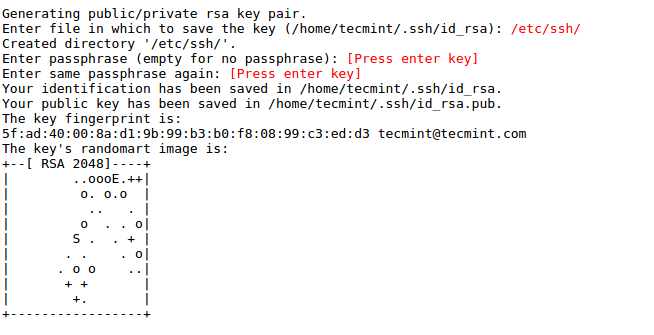

## Setup Production Server
Remarks:
---
* ***Local machine***: local machine refers to the computer that a user is currently using. E.g. laptop or desktop machine you working on.
* ***Remote machine/server*** : A remote machine is computer to which a user does not have physical access. E.g. AWS AMI

* All the below steps are only performed on local machine.
* Its good practice to create SSH key (ssh-keygen) before running playboook.

### create a password-less ssh key

The project repository should be cloned to remote machine. Ansible playbook does this for us. It clones repository from bitbuket using [SSH Key-Based Authentication](https://www.digitalocean.com/community/tutorials/how-to-configure-ssh-key-based-authentication-on-a-linux-server).

1. ssh-keygen command to generate new ssh key. *** DO NOT ENTER PASSPHRASE ***
```
ssh-keygen -t rsa
```
2. When prompt for "Enter file in which to save the key" type `/etc/ssh/`  

3. press enter when prompt for "Enter passphrase" and "Enter same passphrase again"

Follow these steps to create a new passwordless ssh key.


[This is helpful tutorial to create ssh key](http://www.tecmint.com/ssh-passwordless-login-using-ssh-keygen-in-5-easy-steps/)

### Install [Ansible](https://www.vagrantup.com/) in local machine
Please follow the [official installation guide](http://docs.ansible.com/ansible/intro_installation.html)

OR follow the below steps to install it on ubuntu

```
sudo apt-get update

sudo apt-get install software-properties-common

sudo apt-add-repository ppa:ansible/ansible

sudo apt-get update

sudo apt-get install ansible
```

### Add public DSN or IP address to Ansible Inventory
```
sudo nano /etc/ansible/hosts
```
Add the server IP and sudo user

```
ec2-52-35-17-64.us-west-2.compute.amazonaws.com ansible_user=ubuntu
```

### clone project repository
```
git clone git@bitbucket.org:pyramidtechnology/0280020703.git
```

### copy .pem key to project directory
Ansible need to ssh in remote machine(server).
There are two methods to SSH into the remote machine.
* SSH using Password
  * This method requires a sudo user & password
* SSH with .pem key
  * This method requires a .pem key instead of a password.

AWS highly recommend using .pem key to ssh since it is more secure than a password. A password can be shared by word of mouth but a .pem key is limited to an authorized person.
We add .pem key to project folder so that Ansible config can find it. It is not tracked in git. it is ignored in .gitignore file.

```
/test-project/
```

#### Run Ansible playbook
Switch to project root dir and run.

```
sudo ansible-playbook -vvv playbook.yml

```
It will take a couple of minutes depending on your connection(15 minutes).

You can access the web app at public DNS or IP address.


## Running Frontend test Cases

Test cases are accessible at http://domain/test/

```
http://localhost:8000/test/
```
or
```
http://ec2-52-35-17-64.us-west-2.compute.amazonaws.com/test
```

## Running Backend test Cases
1. setup django project on your local machine by [following the steps to step guide in wiki](https://bitbucket.org/pyramidtechnology/0280020703/wiki/Setting%20up%20development%20environment.)

2. Switch to
```
    ~/test-project/backend/
```
3. Run Tests
Assuming virtualenv is active
```
    python manage.py test
```
